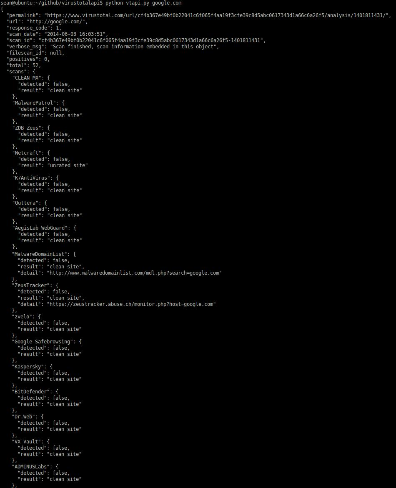

VirustotalAPI
-------------
This python module help you check if the URL or file is malicious through Virustotal public API 2.0

you can get more infomation at https://www.virustotal.com/en/documentation/public-api/

To use this module you need to apply an account and get a public api key at https://www.virustotal.com/

[](https://raw.githubusercontent.com/z-sean-huang/VirustotalAPI/master/vtapi_screenshot.jpg)

Dependency
----------
you need install python `requests` first

    pip install requests

Installation
------------
install by pip

    pip install vtapi

install by git

    cd /tmp
    git clone https://github.com/z-sean-huang/VirustotalAPI.git
    cd VirustotalAPI
    python setup.py install

uninstall

    pip uninstall vtapi


Usage
-----
after install vtapi:
```python
import vtapi

vt = vtapi.VtApi("PUT YOUR VIRUSTOTAL PUBLIC KEY HERE")
    
# rating for url
# you shold get return ('google.com', 0, 52)
# 0 and 52 means 0 virus detected number by 52 virus scan engines
# the higher the detected number, the more likely malicious it is.
print(vt.rating("google.com"))
# get url scan report from virustotal
print(vt.rul_report("google.com"))


# rating for file
# for the privacy sake, I don't send any file to virustotal
# just query if there is the same file in virustotal
# you should keep in mind don't send any secret files to virustotal.
print(vt.rating("/PATH/TO/FILE"))

# rating by file's md5/sha1/sha256
# query by the hash, return none if there doesn't exist.
print(vt.rating("HASH_OF_FILE"))
# get file scan report from virustotal
print(vt.file_report("HASH_OF_FILE"))
```
